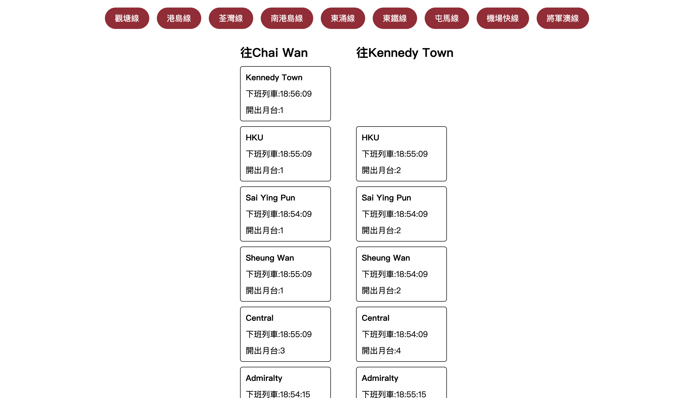

# MTR Train ETA Web App

A simple web application to check the next train ETA for each station on a line.

## Features

- View real-time train arrival times for MTR lines and stations
- Simple, responsive web interface

## Screenshots

## Usage

1. Download or clone this repository.
2. Open `index.html` in your browser.
3. You are ready to use!

## Data Source

Open data from the Hong Kong Government:

https://data.gov.hk/tc-data/dataset/mtr-data2-nexttrain-data/resource/10beffab-22f7-44be-9dd3-dbbd7fa534c3

## Tech Stack

- HTML
- CSS
- JavaScript

## Known Issue

- You may get 429 Too Many Request. This will be fixed later...
